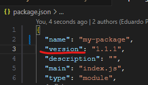
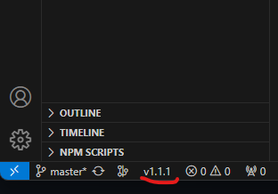

# The Package Version Display - VSCode Extension
This extension make it easy to see the version of your current working no JavaScript/TypeScript module.

## Installation

Download it from the [VSCode Extension Marketplace]()

## How does it work?
This is a package.json file example:

Here is how the extension displays the version on VSCode's status bar:

## Requirements

Currently it works only for JavaScript/TypeScript modules.
They must contain the package.json file.
